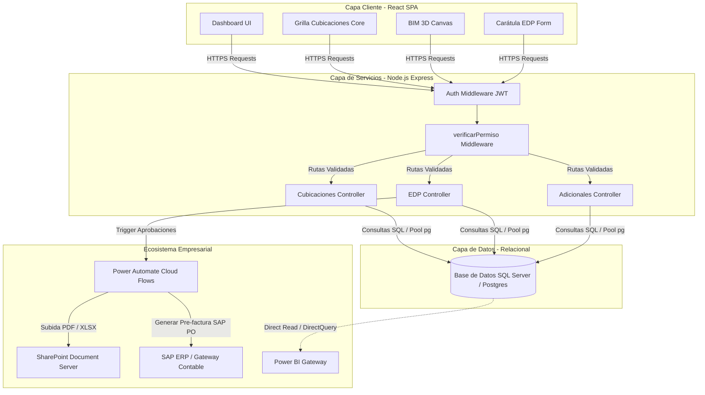

# Arquitectura Técnica e Integración - CUBICAPP

Este documento detalla el diseño de la arquitectura técnica, la pila de tecnologías recomendada, el diagrama lógico y las estrategias de integración de **CUBICAPP** con otros sistemas empresariales (ERP SAP, SharePoint).

---

## 1. Pila de Tecnologías (Tech Stack)

Para garantizar escalabilidad, portabilidad y cumplimiento de los estándares de TI corporativos, se especifica la siguiente arquitectura tecnológica:

```
+---------------------------------------------------------------------------------+
|                                    CAPA CLIENTE                                 |
| Frontend: React (v18+) | Vite | Vanilla CSS / Tailwind CSS | JS/JSX             |
| Librerías: Canvas (3D Render) | html2pdf.js | SheetJS (Excel)                  |
+---------------------------------------------------------------------------------+
                                      |
                                      v [HTTPS / REST API JSON]
+---------------------------------------------------------------------------------+
|                                   CAPA DE SERVICIOS                             |
| Backend: Node.js (v20+) | Express.js | Sequelize / pg-pool                      |
| Seguridad: JSON Web Tokens (JWT) | verificarPermiso Middleware                  |
+---------------------------------------------------------------------------------+
                                      |
                                      v [ADODB / pg-protocol]
+---------------------------------------------------------------------------------+
|                                   CAPA DE DATOS                                 |
| Motores: PostgreSQL (Core) | MS SQL Server (Enterprise Option)                  |
| Alternativa: Microsoft Dataverse (Power Apps Backend)                           |
+---------------------------------------------------------------------------------+
                                      |
                       +--------------+--------------+
                       |                             |
                       v [REST APIs / JSON]          v [MS Graph APIs]
+-------------------------------+             +-----------------------------------+
|     CAPA DE INTEGRACIÓN       |             |         CAPA DE DOCUMENTOS        |
| SAP ERP (Pre-facturación PO)  |             | SharePoint / OneDrive (Archivado) |
+-------------------------------+             +-----------------------------------+
```

### 1.1. Frontend
* **Core**: React.js 18 con Vite para la compilación y desarrollo ultrarrápido de Single Page Applications (SPA).
* **Librerías de Utilidad**:
  * **SheetJS (`xlsx`)**: Lectura y exportación directa de planillas Excel del itemizado y cubicaciones.
  * **html2pdf.js / html2canvas / jsPDF**: Motor en el cliente para compilar y generar los reportes formales de Estados de Pago en PDF respetando la diagramación oficial.
  * **HTML5 2D/3D Canvas API**: Renderizador alámbrico nativo para la visualización del modelo BIM sin depender de costosos visualizadores pesados de terceros.

### 1.2. Backend (API Gateway)
* **Runtime**: Node.js v20 LTS.
* **Framework**: Express.js para estructurar el enrutamiento REST y el control de middlewares de validación.
* **Seguridad**: JWT (JSON Web Tokens) para persistencia de sesión cifrada, y middleware `verificarPermiso` para validación RBAC (Role-Based Access Control) dinámica.

### 1.3. Base de Datos
* **PostgreSQL / SQL Server**: Mantenimiento del esquema relacional altamente indexado descrito en el modelo de datos.
* **Microsoft Dataverse**: Para implementaciones rápidas mediante Power Platform corporativo, aprovechando las tablas de Dataverse y la seguridad integrada de Microsoft Entra ID (Azure AD).

---

## 2. Diagrama Lógico de Arquitectura (Mermaid)

El siguiente diagrama lógico detalla las capas del sistema, el flujo de datos y los puntos de integración con el ecosistema de la organización:



---

## 3. Integración con Terceros (SharePoint y SAP)

### 3.1. Integración con SharePoint (Archivos de Respaldo)
* **Protocolo**: REST API de Microsoft Graph.
* **Mecanismo**: Cuando el flujo de Power Automate de un EDP es aprobado, se compilan los archivos PDF y XLSX en memoria. Power Automate invoca la acción `Crear Archivo` en SharePoint Online bajo el sitio correspondiente al proyecto, estructurado por año y periodo.
* **Trazabilidad**: El enlace directo del archivo creado en SharePoint se inyecta en el campo `documento_adjunto_url` del registro histórico en la base de datos para auditorías de consulta.

### 3.2. Integración con SAP (Pre-facturación Contable)
* **Protocolo**: HTTPS REST JSON o Web Services SOAP.
* **Mecanismo**:
  1. Gerencia firma digitalmente el Estado de Pago en la aplicación.
  2. El sistema compila un payload JSON conteniendo: N° Pedido SAP (recuperado de la tabla `contratos`), Periodo, Neto a Pagar, y el Itemizado con cantidades e importes del mes.
  3. Se realiza una petición `POST` al endpoint del SAP PO (Process Orchestration) o SAP Integration Suite.
  4. SAP valida la imputación presupuestaria (PEP / Centro de Costos) y retorna un ID de transacción de pre-factura, el cual queda guardado en `historico_edp` para la conciliación bancaria final.
