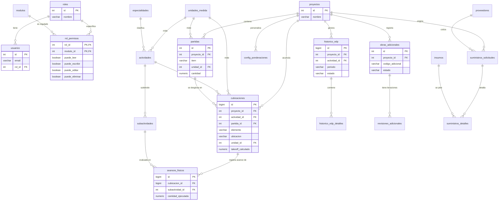

# Relaciones de Entidades y Diagrama ERD - CUBICAPP

Este documento describe las relaciones lógicas y físicas de la base de datos de **CUBICAPP**, incluyendo la clasificación de cardinalidades, el modelo relacional textual y el Diagrama Entidad-Relación (ERD) en formato Mermaid.

---

## 1. Clasificación de Relaciones por Cardinalidad

### 1.1. Relaciones Uno a Uno (1:1)
* **`historico_edp` a `facturas_edp` (Propuesto en ERP)**: Cada Estado de Pago aprobado tiene una única factura comercial asociada emitida en el ERP externo para su cobro final.

### 1.2. Relaciones Uno a Muchos (1:N)
* **`roles` a `usuarios` (1:N)**: Un rol (ej. Oficina Técnica) puede estar asignado a múltiples usuarios del sistema, pero cada usuario pertenece a un solo rol.
* **`proyectos` a `partidas` (1:N)**: Un proyecto de obra contiene múltiples partidas o ítems presupuestarios jerárquicos. Cada partida pertenece exclusivamente a una obra.
* **`proyectos` a `cubicaciones` (1:N)**: Un proyecto acumula cientos de registros de cubicaciones detalladas. Cada fila de cubicación está asociada a un único proyecto.
* **`actividades` a `subactividades` (1:N)**: Una actividad técnica (ej. Hormigón) se subdivide en varias subactividades operativas (ej. Excavación, Enfierradura, Hormigonado).
* **`partidas` a `cubicaciones` (1:N)**: Una partida presupuestaria (ej. 1.2.1 Hormigón Columnas) puede recibir aportes volumétricos de múltiples registros de cubicación individuales (ej. Columna A1, Columna A2).
* **`cubicaciones` a `avances_fisicos` (1:N)**: Una cubicación de elemento constructivo tiene un historial de avances reales ingresados en terreno por subactividad a lo largo del tiempo.
* **`historico_edp` a `historico_edp_detalles` (1:N)**: Cada "foto" de Estado de Pago consolidado contiene múltiples líneas de registros detallando el avance cobrado por elemento.
* **`obras_adicionales` a `revisiones_adicionales` (1:N)**: Una solicitud de obra adicional pasa por un proceso iterativo de revisiones técnicas e incrementos de montos antes de su aprobación final.

### 1.3. Relaciones Muchos a Muchos (N:M)
* **`roles` a `modulos` (N:M a través de `rol_permisos`)**: Un rol tiene permisos sobre múltiples módulos (Mantenedor, Cubicaciones, Aprobaciones), y un módulo es accedido por múltiples roles con distintos privilegios.
* **`proyectos` a `actividades` (N:M a través de `actividades_proyectos`)**: Un proyecto tiene activas múltiples actividades del catálogo maestro, y una actividad puede ejecutarse en múltiples proyectos en paralelo.
* **`proyectos` a `usuarios` (N:M a través de `usuarios_proyectos_roles`)**: Un proyecto tiene asignado un equipo de trabajo (personal con un rol específico en esa obra), y un usuario puede estar asignado a varios proyectos con roles de obra independientes.

---

## 2. Diagrama de Entidad-Relación (ERD)

A continuación se muestra el diagrama relacional completo en formato **Mermaid**. Este diagrama especifica las relaciones y los campos clave que enlazan las tablas:

---

## 3. Integridad Referencial y Reglas de Cascada (FK Constraints)

Para asegurar la consistencia del sistema frente a eliminaciones y actualizaciones en cascada:

1. **Eliminación de Proyectos (`proyectos`)**:
   * Si se elimina un proyecto, se debe ejecutar un borrado en cascada (`ON DELETE CASCADE`) para: `partidas`, `cubicaciones`, `config_ponderaciones`, y `obras_adicionales`.
   * Para resguardar información contable e histórica, no se permite eliminar proyectos que posean registros en `historico_edp` con estado "Aprobado" (Restricción `ON DELETE RESTRICT`).

2. **Eliminación de Actividades (`actividades`)**:
   * La eliminación de una actividad gatilla `ON DELETE CASCADE` en sus `subactividades`.
   * No se permite eliminar actividades que ya tengan registros asociados en `cubicaciones` o `historico_edp`.

3. **Modificación de Códigos de Itemizado (`partidas.item`)**:
   * Si se actualiza el código del ítem (ej. de 1.2 a 1.2.1), se debe replicar en cascada (`ON UPDATE CASCADE`) en todas las referencias del módulo de cubicaciones para no perder la trazabilidad presupuestaria.
